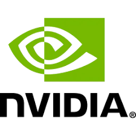
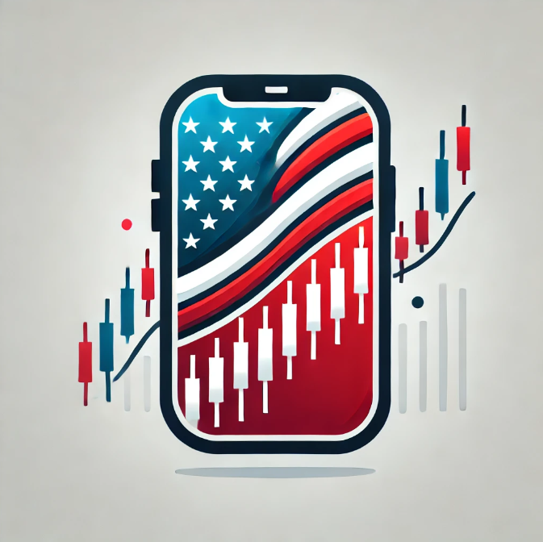


# 📈Across The Pacific (미국 주식 포트폴리오 공유 앱)


## 🗂️ 목차
0. [배포 링크](#배포-링크)
1. [💻 기술 스택](#-기술-스택)  
2. [👩‍💻 팀원 소개](#-팀원-소개)
3. [📊 프로젝트 개요](#-프로젝트-개요)  
   1.1. [소개](#1️⃣-소개)  
   1.2. [배경](#2️⃣-배경) 
4. [📁 백엔드 및 DB 관련 요구사항](#-📁-백엔드-및-DB-관련-요구사항)   
5. [🔧 JSON 요청/응답 테스트(Postman)](#-🔧-JSON-요청/응답-테스트(Postman))
6. [🔧 실제 테스트](#-🔧-실제-테스트)
7. [📊 성능 테스트](#-📊-성능-테스트)
8. [📄 기타 문서](#-기타-문서)
   
<br>

## 🚀 배포 링크
🔗[Across The Pacific](https://celarim.kro.kr)

<br>

<br>

## 📰 시스템 아키텍쳐


<br>

## 💻 기술 스택


### ☑️ 기획


<br>

### ☑️ 배포


<br>


### ☑️ DB & Monitoring


<br>

### ☑️ BACK END
**메인 백엔드**


**크롤러**


* [크롤러 리포지토리](https://github.com/Xen-alpha/polygon.io-crawler)

### 설치법
[설치법 소개 위키 페이지](https://github.com/beyond-sw-camp/be12-3rd-Mr.Krabs-Across-The-Pacific/wiki/How-to-Install)

##  👩‍💻 팀원 소개
<table>
  <tbody>
    <tr>
      <td align="center"><a href=""><br /><sub><b> 팀장: 김경준 </b></sub></a><br /></td>
      <td align="center"><a href=""><br /><sub><b> 팀원: 김혜정</b></sub></a><br /></td>
      <td align="center"><a href=""><br /><sub><b>팀원: 신지현</b></sub></a><br /></td>
      <td align="center"><a href=""><br /><sub><b>팀원: 이의범</b></sub></a><br /></td>
      <td align="center"><a href=""><br /><sub><b>팀원: 황경윤</b></sub></a><br /></td>
  </tbody>
</table>


<br>

## 📊 프로젝트 개요

### 1️⃣ 소개

"모두가 함께 성장하는 투자 플랫폼, Across The Pacific"



Across The Pacific은 미국 주식 투자 포트폴리오 공유 및 투자 전략 학습을 위한 소셜 기반 플랫폼입니다.  

> **목표**: 정보의 비대칭성을 해소하고 개인 투자자들에게 투자 인사이트를 제공하여 함께 성장하는 투자 문화를 구축

<details>
  <summary>Across The Pacific 상세 소개</summary>
 Across The Pacific 은 사용자끼리 자신의 미국 주식 투자 포트폴리오를 공유하여 다양한 투자 전략과 정보를 교류할 수 있는 소셜 기반의 투자 플랫폼입니다.

사용자는 Across The Pacific 시스템읕 통해 포트폴리오를 생성하여 자신의 투자 성과를 시각화하여 볼 수 있으며, 기간별 수익률을 시뮬레이션할 수 있으며, 다른 투자자들의 포트폴리오를 참고하여 새로운 투자 기회를 탐색하여 투자 인사이트를 확장하고, 타인과 함께 성장할 수 있습니다.

Across The Pacific은 단순히 주식 투자 수익률 추적을 넘어, 미국 주식 투자에 처음으로 발을 들이려는 이, 혹은 꾸준히 투자를 했으나 자신이 제대로 잘 하고 있는지 길라잡이가 필요한 사람들, 자신의 경험을 공유하고 타인에게 도움을 주려는 사람들이 서로 정보를 공유할 수 있는 장을 만들어 사용자 간의 공유, 학습, 성장이라는 새로운 투자 문화를 형성하는 것이 목표입니다.

</details>


### 2️⃣ 배경
#### 1. 제안 배경

<details> 
  <summary> 제안 배경 상세 소개</summary>

1. 기대 수명의 꾸준한 증가

출처 : https://www.index.go.kr/unify/idx-info.do?idxCd=8016

한국 인구의 기대수명은 1970년 62.3세에서 2023년 83.5세로 약 21년 늘어났으나, 정년퇴직 나이는 여전히 법적으로는 60세에 그쳐, 이제 노동 소득뿐만 아니라 금융 소득을 가지는 것도 중요하게 되었습니다. 그러나 대한민국 주식 시장의 제도 개선이 늦어지면서 장기적인 투자를 위해 자금 투입을 할 경우 안정적인 투자가 어려워, 많은 사람들이 활황을 보이는 미국 주식에 관심을 가지는 등 주식투자 성향이 다변화 되었습니다.

2. 미국 주식 투자에 대한 관심 증가


최근 개인 투자자들의 미국 주식에 대한 관심이 급증하고 있습니다. 해외 주식 거래 플랫폼의 확산과 다양한 미디어의 주식 정보 제공으로, 더 많은 사람들이 해외 주식 투자를 시작하고 있습니다.

3. 투자 정보의 불균형 해소 필요 


대형 투자 기관이나 전문 투자자들은 방대한 데이터와 분석 도구를 활용할 수 있지만, 일반 개인 투자자들은 제한된 정보와 소수의 투자 종목에 집중하는 경향이 있습니다. 이로 인해 투자 시야가 제한되고, 투자 기회를 놓칠 가능성이 큽니다.

4. 단순 기록을 넘어선 ‘투자 인사이트 제공’의 필요성
단순 기록을 넘어선 ‘투자 인사이트 제공’의 필요성 기존의 투자 앱들은 주로 투자 기록 관리나 수익률 확인에 국한되어 있습니다. 하지만 사용자들은 단순한 수익률 조회가 아니라, 어떻게 투자 전략을 개선할 수 있는지에 대한 인사이트를 원합니다.

</details>

#### 2. Across The Pacific 서비스의 필요성
<details>
<summary>서비스 필요성 세부 사항</summary>

1. 타인의 주식을 참고해 투자를 시작하고싶으나 시작 정보를 어디서 얻어야할지 모르는 사람들이 많다.

2. 자신의 투자가 안정적인지, 현재 투자 상황의 위험도가 어느정도인지 정확히 인지하지 못하는 사람들이 있다.

3. 타인이 올린 투자 상황 및 시각 데이터가 얼마나 믿을만한지 신뢰성을 따지기 어렵다.

</details>

#### 3. Across The Pacific 서비스를 통한 해결 방안
<details>
  <summary>서비스를 통한 해결 방안 세부 사항</summary>

1. 자신의 포트폴리오 작성 및 분석을 통해 자신의 투자 판단을 객관적인 시계열 데이터에 기반해 검증할 수 있다.

2. 분산투자를 장려할 수 있도록 시뮬레이션을 통해 명확하게 시각화된 정보를 제공한다.

3. 서로간의 투자 정보를 공유함으로써 정보 비대칭을 해소하는 데에 도움을 줄 수 있다.

4. 자신의 포트폴리오 공개를 장려하기 위해 분기 단위로 북마크 기능에 기반하여 인기 포트폴리오 순위를 선정해 많은 북마크 수를 가진 사용자들에게 분기별 인증 마크를 부여한다.

Across The Pacific은 위의 문제점들을 보완하여 꾸준히 높아지는 기대 수명에 맞춰 투자가 필요하다고 느끼고 처음으로 진입하는 사람들 혹은 투자는 하고 있지만 방향성을 제대로 잡지 못한 사람들을 위해 포트폴리오를 생성하고 시뮬레이션 및 수익률을 분석, 타인과의 공유를 통해 투자 전략 개선 제안 등의 기능을 제공합니다.

</details>

### <summary><b>3️⃣ 시나리오</b></summary>
<details>
<summary> 시나리오 1</summary>
<div markdown="1">
1. 자신의 포트폴리오를 확인하려는 사용자(가명 김경준씨, 20살 주식 6개월 차)

친구따라서 주식을 시작하게된 김경준씨. 친구를 따라서 구매한 테슬라 주식의 가격이 급등해 돈을 번 순간 자신감이 넘쳐 위험투자를 했다가 돈을 잃게된다. 조금 더 객관적으로 자신의 투자를 분석해야겠다는 생각이 들어 주식포트폴리오를 작성하고자 하였고 ATP사이트를 방문하게 된다. 사이트 방문 후 개인 포트폴리오 작성 버튼을 누른다. 회원 가입을 하라는 사이트의 알림에 회원가입을 진행하고 로그인 후 개인 포트폴리오 작성을 시작한다. 우선 자신의 현재 돈을 적고 구입하고 팔았던 주식과 시기 가격을 작성하여 포트폴리오를 만든다. 해당 정보를 기입하니 자산변화 그래프와 구입했던 주식들 목록이 나오게 된다.

일주일 후 새롭게 애플 주식을 구입한 김경준씨 더 나은 주식 생활을 위해 포트폴리오를 꾸준히 작성하기로 하고 다시 사이트를 방문한다. 로그인을 하고 마이페이지로 들어가 내 포트폴리오 관리를 누른다. 저번주에 작성한 포트폴리오가 있었고 저번 주까지의 주식들의 총 변동량을 그래프로 보여준다. 변동을 확인하고 구매한 애플 주식을 추가하기 위해서 수정 버튼을 눌러 새롭게 구매한 주식의 정보를 적고 수정한다.

</div>
</details>
<details>
<summary>시나리오 2</summary>
<div markdown="2">

2. 타인의 포트폴리오를 확인하려는 사용자(김경준씨)

자신의 포트폴리오를 작성했지만 더 뭘 사야할지 모르겠는 김경준씨는 남들이 어떻게 하는지 궁금해서 타인의 포트폴리오를 보기로 한다. 사이트의 포트폴리오를 클릭하니 인기순으로 정렬된 타인의 포트폴리오 목록이 나와서 찬찬히 둘러본다. 자신과 비슷한 사용자는 어떻게 구매를 했나 보려고 검색 버튼을 눌러 자신이 구매했던 테슬라와 애플 주식을 검색하니 현재 포트폴리오에 해당 주식을 가진 포트폴리오들이 인기순으로 정렬되어 나온다. 해당 포트폴리오를 클릭하여 포트폴리오 상새정보를 클릭해보니 자신이 목표로 하는 수익을 지난 기간동안 냈었고, 이를 참고하기 위해 북마크 버튼을 클릭해서 북마크에 등록하였다. 그리고 비슷한 다른 포트폴리오들을 확인해보니 수익이 좋은 사람들이 공통적으로 구매한 주식을 찾을 수 있었고 김경준씨는 그 주식을 구매하게 된다.

</div>
</details>

<details>
<summary>시나리오 3</summary>
<div markdown="3">

3. 숨은 주식 고수 (가명 이의범씨, 50세, 주식 고수)

주식으로 월 300을 벌면서 경제적 자유를 이룩한 이의범씨는 회사를 은퇴하고 주식을 관리하게 된다. 자신의 포트폴리오를 등록해서 운영하던 와중에 자신의 포트폴리오의 북마크가 늘어나서 남들이 추천을 하니 기분이 좋아진다. 그리고 사이트에서 뱃지를 달아줘서 명예로워졌다. 그러자 당신의 프로파일을 주시하는 사용자가 늘어나 현재 4321명의 사용자가 당신의 프로파일을 팔로우하고 있다.

</div>
</details>
<details>
<summary>시나리오 4</summary>
<div markdown="4">

4. 이번 분기 GOAT 포트폴리오 (가명 김혜정씨, 23세)

올해 8월에 자신의 주식 포트폴리오를 만들어 공개한 김혜정씨는 크리스마스에 홈페이지에 자신의 포트폴리오가 대문에 있는 ‘이번 분기의 인기 포트폴리오’에 1등으로 올라온 것을 보게 되었다. 혜정씨의 포트폴리오가 19720개의 북마크를 받아 4분기에서 가장 많은 북마크를 받은 것이다. 그리고 새해가 되자 다른 사람들이 혜정씨의 포트폴리오를 볼 때마다 작성자란 옆에 ‘202X년 4분기 인기 포트폴리오 제작자’ 마크를 볼 수 있게 되었고, 혜정님의 회원 등급이 1점 상승했다. 혜정씨는 다음 분기 포트폴리오를 잘 짜서 한 번 더 마크를 받는 데 도전하기로 한다.

</div>
</details>

</details>

<br>

## 📁 백엔드 및 DB 관련 요구사항

**DBMS 변경점: 하나의 Master DB Server와 여러 대의 Slave DB Server에서 구동되는 MariaDB + MongoDB atlas를 사용하는 MongoDB**

주식 가격 정보를 제외한 모든 정보는 MariaDB에 저장하며 MariaDB의 경우 포트폴리오 생성보다는 조회에 초점을 맞춰, 데이터 조회 요청을 집중적으로 처리하는 Query-off Loading 방식 채택하기로 하였다.

만일 마스터 DB 서버가 멈출 경우 복제 DB 서버의 동기화가 끊어지는 상황이 있을 수 있다. 이에 대비해 DB Server들은 HAProxy와 같은 로드 밸런서를 통해 가상의 IP를 통해 백엔드와 통신하게 하여, 마스터가 멈추더라도 남은 슬레이브 DB들을 통해 단순한 포트폴리오 조회 작업 정도는 가능하게 만드는 등의 논의를 진행하였으나, 클라우드 내 가용 인스턴스 자원 부족으로 보류하여 도커 컨테이너를 도입하기 전까지 Query-off Loading을 사용하지 않고 단일 DB를 사용하기로 결정했다.

한편 주식 가격 관련 서비스를 사용하기 위한 외부 서비스의 API 호출 횟수 제한이 높아 단순히 프론트엔드 또는 백엔드에서 외부 API를 직접 호출하기에는 원하는 만큼 데이터를 모을 수 없었다. 따라서 Node.js에 기반해 제작한 간단한 크롤러를 만들어 BSON 구조로 데이터를 저장하는 MongoDB에 데이터를 저장한 다음 프론트엔드가 백엔드에 주가 정보를 요청하면 MongoDB에서 즉시 다량의 정보를 꺼내오도록 구성하였다. 또한 저장해야 할 주식 가격의 정보가 100만개 이상으로 매우 많으며 한번 저장한 특정 시점의 특정 종목 가격 데이터를 갱신할 일이 없다는 점도 MongoDB를 주식 가격 저장소로 채택한 이유다.

**레이어드 아키텍처**

서비스의 복잡성을 고려했을 때 이 프로젝트에 3종 이상의 기능 분류가 필요하기에 단일한 서비스에 적절한 단순한 MVC 패턴은 적합하지 않다고 판단되며, 반면 멀티모듈 프로젝트나 MSA를 구성하기에는 아키텍처 구현을 위한 시간과 노력에 비해 프로젝트의 규모가 작았기 때문에 과도하게 프로젝트가 복잡해질 우려가 있어 이 또한 적절하지 않았다. CQRS 구조를 채택하지 않은 것은 주식 관련 정보, 포트폴리오 관련 정보, 사용자 정보 및 다른 사용자의 댓글 정보가 담긴 테이블 간의 연관 관계가 복잡하게 얽혀 있어 프로젝트 기간 내에 메세지를 전달하고 동시성 제어를 구현하기 매우 어려울 것으로 판단하였기 때문이다. Query-off Loading으로 여러 대의 DB 서버를 구성하기로 하였으므로 CQRS로 백엔드에서 동기화하는 방법은 완전히 제외하였다.

사용하는 DBMS가 두 종류이기 때문에 헥사고날 아키텍처를 사용할 수도 있으나, 사용 중인 DBMS 중 MongoDB 내 데이터들은 순수하게 주가 그래프를 그리거나 최신 주가를 가져오는 용도로만 사용하며, 해당 데이터들은 프론트엔드에서 가공하여 사용자에게 표시하기로 정했다. 따라서 인터페이스를 여러 개 만들기보다 두 DBMS에 대해 서비스하는 계층이 완전히 분리된 레이어드 아키텍처로 구현하는 것이 코드를 작성하기 위해 필요한 시간이 더 적고 유지보수가 간편하다고 판단되어 백엔드 구조로 레이어드 아키텍처를 채택했다.

**Layered 패턴**
Backend 서버를 Web Layer, Service Layer, Repository Layer의 3개의 계층으로 분리하여 적용한다.  
3계층 Layered Architecture를 선택한 이유는 다음과 같다.
1. Backend와 연결된 곳이 Frontend와 database 뿐이다.
2. 주요 기능이 계층을 나누어 관리할 만큼 복잡하지 않다.
3. 주요 기능과 외부 연결(frontend, database)에 필요한 계층을 분리하여 단일 책임 원칙을 지킬 수 있도록 한다.

각 계층의 역할은 다음과 같다.
- Web Layer는 frontend와 통신하며 http 요청을 dto로 전환하여 Service Layer에 전달한다.
- Service Layer는 dto를 전달 받아 주요 기능을 수행하여 이를 Entity로 전환하여  Repository Layer에 전달한다.
- Repository Layer는 해당 Entity를 database에 전달한다.


<br>


## 🔧 JSON 요청/응답 테스트(Postman)
<!-- TODO -->
<details>
<summary>포트폴리오 생성/수정</summary>
* 생성 요청
```json
```
   
* 생성 응답
```json
```

* 수정 요청
```json
```
* 수정 응답
```json
```
</details>

<details>
<summary>포트폴리오 상세 페이지 조회/수정/삭제/댓글달기</summary>
* 조회 요청

* 조회 응답
```json
```

* 댓글 달기 요청
```json
```
* 댓글 달기 응답
```json
```

</details>

<details>
<summary>주식 종목 조회 및 상세 페이지</summary>
* 요청

* 응답
```json
```


</details>

<details>
<summary>주식 상세 페이지 그래프 조작</summary>
* 목록 요청

* 목록 응답
```json
```
* 그래프 요청

* 그래프 응답
```json
```

</details>

<details>
<summary>주식 상세 페이지 댓글 작성</summary>
* 정보 요청

* 정보 응답
```json
```
   
* 댓글 작성 요청
```json
```
* 댓글 응답
```json
```

</details>


<details>
<summary>주식 상세 페이지 댓글 좋아요, 수정/삭제</summary>
* 좋아요 요청
```json
```
* 좋아요 응답
```json
```

* 댓글 수정 요청
```json
```
* 댓글 수정 응답
```json
```

* 댓글 삭제 요청
```json
```
* 댓글 삭제 응답
```json
```

</details>
<details>
<summary>로그인, 로그아웃</summary>
* 로그인 요청
```json
```
* 로그인 응답
```json
```

* 로그아웃 요청
```json
```
* 로그아웃 응답
```json
```

</details>

<details>
<summary>404 Redirect</summary>
* 요청
```json
```
* 응답
```json
```


</details>

<details>
<summary>프로필 및 설정</summary>
* 요청
```json
```
* 응답
```json
```

</details>

## 🔧 실제 테스트


<details>
<summary>메인 페이지</summary>


</details>

<details>
<summary>포트폴리오 생성/수정</summary>


</details>

<details>
<summary>포트폴리오 상세 페이지 조회/수정/삭제/댓글달기</summary>


</details>

<details>
<summary>주식 종목 조회 및 상세 페이지</summary>


</details>

<details>
<summary>주식 상세 페이지 그래프 조작</summary>


</details>

<details>
<summary>주식 상세 페이지 댓글 작성</summary>


</details>


<details>
<summary>주식 상세 페이지 댓글 좋아요, 수정/삭제</summary>


</details>
<details>
<summary>로그인, 로그아웃</summary>


</details>

<details>
<summary>404 Redirect</summary>


</details>

<details>
<summary>프로필 및 설정</summary>


</details>

<br>

## 📊 성능 테스트
메인 페이지에서 포트폴리오 목록을 조회할 때 발생하는 N+1 문제를 해결하기 위해, JPA 기반의 단순 조회 방식에서 QueryDSL을 활용한 최적화 쿼리로 개선

### 개선 이전
#### 🔎기존 문제점 (N+1 문제 발생)

기존에는 JpaRepository를 활용하여 포트폴리오 목록을 조회하는 방식이었으며, 조회수(view count) 기준으로 정렬하여 페이지네이션을 적용하는 방식이었다.

```java
public interface PortfolioRepository extends JpaRepository<Portfolio, Long>, PortfolioCustomRepository{
    Page<Portfolio> findAllByOrderByViewCntDesc(Pageable pageable);
}
```
**포트폴리오 목록을 조회수 내림차순으로 불러오되, 페이지네이션 외에는 특별한 처리를 하지 않은 JPA 코드*

.png)
.png)
.png)

단순히 Portfolio 목록을 조회하는 구조로, 각 포트폴리오에 대한 추가적인 정보(북마크, 보유 주식 등)를 가져올 때 추가 쿼리 발생

결과적으로 N개의 포트폴리오를 조회하면, 추가로 N개의 개별 쿼리 실행 (N+1 문제 발생)

쿼리 실행 횟수가 많아져 성능 저하 및 불필요한 DB 부하 발생

쿼리 수: N+1 문제로 인해 불필요한 다수의 개별 쿼리 실행

조회 속도: 평균 26000(ms)

### 개선 이후
```java
//PortfolioCustomRepository.java
public interface PortfolioCustomRepository {
  //메인 페이지에서 포트폴리오 목록 조회
  Page<PortfolioInstanceResp> findAllByOrderByKeyword(Pageable pageable, String keyword);
}
```
```java
//PortfolioCustomRepositoryImpl.java
  @Override
  public Page<PortfolioInstanceResp> findAllByOrderByKeyword(Pageable pageable, String keyword) {
    // 정렬 조건
    OrderSpecifier<?> orderSpecifier = getSortedColumn(keyword);
    // QueryDSL을 이용한 최적화된 포트폴리오 조회 (N+1 문제 해결)
    List<Tuple> portfolioList = queryFactory
        .select(portfolio.idx, portfolio.name, portfolio.imageUrl, portfolio.viewCnt, bookmark.count(), portfolio.badges)
        .from(portfolio)
        .leftJoin(bookmark).on(bookmark.portfolio.eq(portfolio))
        .orderBy(orderSpecifier)
        .groupBy(portfolio)
        .offset(pageable.getOffset())
        .limit(pageable.getPageSize())
        .fetch();

    // 포트폴리오 ID 목록을 추출하여 관련 데이터 조회 (Acquisition & Stock)
    List<AcquisitionInstanceResp> acquisitionList = acquisitionList(portfolioIds(portfolioList));

    // 북마크 여부 확인 (로그인 유저가 특정 포트폴리오를 북마크했는지)
    List<Long> bookmarkList = queryFactory
        .select(bookmark.user.idx)
        .from(bookmark)
        .where(bookmark.portfolio.idx.in(portfolioIds(portfolioList)))
        .fetch();

    // 최종 결과 매핑 (데이터를 Response DTO 형태로 변환)
    List<PortfolioInstanceResp> result = portfolioList.stream()
        .map(tuple -> PortfolioInstanceResp.builder()
            .idx(tuple.get(portfolio.idx))
            .name(tuple.get(portfolio.name))
            .imageUrl(tuple.get(portfolio.imageUrl))
            .viewCnt(tuple.get(portfolio.viewCnt))
            .badges(tuple.get(portfolio.badges))
            .bookmarkCnt(Math.toIntExact(tuple.get(bookmark.count())))
            .bookmarkUsers(bookmarkList)
            .acquisitionList(acquisitionList)
            .build()
        ).toList();

    return new PageImpl<>(result, pageable, result.size());
  }

```
*필요한 Entity를 전부 Join하지 않고, Portfolio Idx를 추출하여 해당하는 데이터만 따로 목록을 불러와서 RepsonseDto에 매핑*

.png)
.png)
.png)

#### 🔎성능 개선 내용

1. QueryDSL을 사용하여 불필요한 개별 쿼리 실행 없이 포트폴리오 데이터 조회
2. 포트폴리오 ID 목록을 추출하여 이에 해당하는 Acquisition을 Stock과 Join하여 따로 추출 (MultipleBagFetchException를 방지)
3. 사용자가 로그인한 경우 포트폴리오 목록에서 북마크 여부를 반영하기 위해 2번과 마찬가지로 포트폴리오 ID 목록에 해당하는 북마크 리스트를 따로 추출
4. 페이지네이션을 적용하여 쿼리 효율성 극대화

### 결과 비교

#### 🔍 1. 요청 수 증가

|항목	|기존 결과	|개선 결과	|개선 효과|
|---|----------|----------|-------|
|Requests (요청 수)|	4,429	| 9,810|	✅ 2.2배 증가|

- 동일 시간 내 처리 가능한 요청 수가 2배 이상 증가
- 시스템의 처리량이 증가했음을 의미

#### 🚀 2. 응답 속도 개선

|항목	|기존 결과	|개선 결과	|개선 효과|
|-----|--------|-----------|---------|
|Median (ms)|	26,000|	10,000|	✅ 61.5% 감소|
|95%ile (ms)|	39,000	|13,000|	✅ 66.6% 감소|
|99%ile (ms)|	43,000	|13,000	|✅ 69.7% 감소|
|Average (ms)|	27,899.14|	9,819.55	|✅ 64.8% 감소|
|Min (ms)|	3,022|	337|	✅ 88.8% 감소|
|Max (ms)|	44,770	|14,141|	✅ 68.4% 감소|

- 평균 응답 속도(27.8초 → 9.8초) 및 최대 응답 속도(44.7초 → 14.1초)가 대폭 감소
- 95~99% 구간에서도 응답 시간이 크게 줄어 일관된 성능 제공 가능
- 최소 응답 시간(337ms)도 크게 감소, 빠른 응답이 가능해짐

#### ⚡ 3. 처리량 및 성능 지표 향상

|항목	|기존 결과	|개선 결과	|개선 효과|
|-----|--------|-----------|---------|
|RPS (Requests Per Second)|	32.1|	90.9|	✅ 2.8배 증가|
|Average size (bytes)|	5,502	|31,245|	⬆ 6배 증가|

- RPS(초당 요청 수)가 32.1 → 90.9로 약 2.8배 증가 → 서버가 더 많은 요청을 처리 가능
- 응답 크기가 5,502 → 31,245로 증가 → 더 많은 데이터가 포함되었음을 의미 (추가 정보 포함 가능성)

#### 🎯 4. 결론
✅ N+1 문제를 해결하고 QueryDSL을 적용한 결과, 응답 속도와 처리량이 크게 향상되었음.

✅ 요청 처리량이 2배 이상 증가했으며, 평균 응답 시간은 3배 가까이 단축됨.

✅ 최소 및 최대 응답 시간이 모두 줄어들어 안정적인 성능 제공 가능.

✅ 동일 시간 내 더 많은 요청을 처리할 수 있어 서버 성능이 개선됨.


## 📄 기타 문서
[👉🏼 프로젝트 기획안](https://docs.google.com/document/d/10S8pPWJzgGtz6S1djeimFvKHkFpN2KdOCY7mrUeAtj4/edit?pli=1&tab=t.b3v4vsjloy9)

<br>

[👉🏼 요구사항 정의서](https://docs.google.com/spreadsheets/d/1woSNDRkSPBwEEkWzr27yUoJJfmwXYKzcMOCcOs6mO3c/edit?usp=sharing)

<br>

[🔗 프론트엔드](https://github.com/beyond-sw-camp/be12-2nd-Mr.Krabs-Across-The-Pacific)

